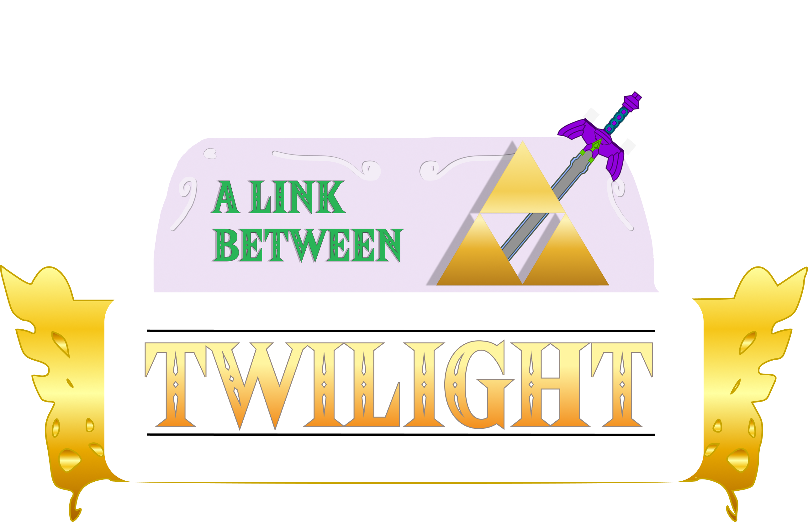

<div align="center">
  

  <p align="center">
    <a href="https://github.com/WadeWinningWilson/A-Link-Between-Twilight">A Link Between Twilight on GitHub</a>
  </p>
</div>

# A Link Between Twilight

**A Link Between Twilight** is a PC mod for [Dusklight](https://github.com/TwilitRealm/dusklight) — the open-source reimplementation of _The Legend of Zelda: Twilight Princess_ — that adds an _A Link Between Worlds_–style **energy meter**, **death item strip**, **Postman rental shop**, and a suite of optional combat and economy tweaks (shield parry/durability, wolf combat, enemy HP scaling, death rupee orb, enemy death rupees, and more).

> **You must provide your own legal copy of the game.** This repository does not include copyrighted assets.

Inspired by CaptainKittyCa2’s ALBW meter mod work. Base game by [TwilitRealm](https://twilitrealm.dev).

## Features Include (**toggle to your preference!**)

| Feature | Status |
|--------|--------|
| ALBW energy meter HUD | ✅ |
| Meter drain (sword, agility, hidden skills) | ✅ |
| Manual shield / parry & bash charges / durability (optional) | ✅ |
| Focused Arts — hidden skill charge bank & finishers (optional) | ✅ |
| Extra Item Slot + Quick Equip Wheel (optional) | ✅ |
| Strip 13 items on Death | ✅ |
| Soul of Light — half wallet on death, recover at the death spot (optional) | ✅ |
| Outfit Stats + Sumo fists-only visual (optional) | ✅ |
| Shade's Refuge + Realtime Potions — soulslike rest/drink (optional, WIP) | ⏳ |
| Deku Leaf Glide (optional, WIP) | ⏳ |
| Cycle Z-Targeting | ✅ |
| Wolf Link combat overhaul (optional) | ✅ |
| Enemy HP multipliers — Normal / Mid-Boss / Boss / Final (optional) | ✅ |
| Enemy Wealth + HUD popup (optional) | ✅ |
| Final Pricing Passes| ⏳ |
| Postman shop — heart & ALBW meter upgrades (Master Quest) | ✅ (stamina row icon swap pending) |
| Enemy HP multiplier final touches| ⏳ |
| Boss Refinement| ⏳ |

Turn on or off most settings and features to your preference under **Settings → ALBW** (Systems, Difficulty, Quality of Life, Master Quest, Visuals).

Full gameplay, settings, and source file list: **[docs/ALBT-Features-Overview.md](docs/ALBT-Features-Overview.md)**.

Latest release notes: **[docs/patch-notes-v0.55.md](docs/patch-notes-v0.55.md)** (v0.55 since v0.5).

---

## Play the latest release (Windows)

You do **not** need to compile. Companion mods are a separate install, found inside: `companion_mods\_release\`

### 1. Source tree + Windows build

Download **two** things from GitHub:

1. **Source** — on [the repository](https://github.com/WadeWinningWilson/A-Link-Between-Twilight), use **Code → Download ZIP** (or clone). Extract it. That folder is the source tree (`companion_mods`, docs, and the rest).
2. **Windows build** — from **[Releases](https://github.com/WadeWinningWilson/A-Link-Between-Twilight/releases)**, the current zip:

   **[A-Link-Between-Twilight-v-0.8-windows-x86_64.zip](https://github.com/WadeWinningWilson/A-Link-Between-Twilight/releases/download/v-0.8/A-Link-Between-Twilight-v-0.8-windows-x86_64.zip)** (pre-release alpha).

   Extract it. Inside is `build\windows-msvc-relwithdebinfo\` — `dusklight.exe`, the runtime DLLs, and `res/`.

Copy that entire **`build`** folder into the extracted source.

### 2. First run

Same disc support as Dusklight: your own legal **GameCube USA** Twilight Princess disc image.

Run `build\windows-msvc-relwithdebinfo\dusklight.exe` once. Pick the disc in the launcher, or pass `--dvd "C:\path\to\your\game.iso"`. Then quit. First run creates `data\` next to the exe so companion mods have somewhere to land.

GPU: D3D12, Vulkan, or Metal capable card recommended.

### 3. Companion mods

Found in `companion_mods\_release\` in the source tree.

| Pack | What it does |
|------|----------------|
| **Armogohma Custom** | Reveal model for the refined Armogohma phase-3 fight |
| **MM-SkullKid-Reskin** | Majora's Mask Skull Kid over TP's Skull Kid |
| **Wind Waker Skins** | Wind Waker skins of TP equipment, from TP's own files (Deku Leaf included) |

Run the game once and quit (step 2), then either:

- Double-click **`INSTALL.bat`** in `companion_mods\_release\`, **or**
- Unzip **`ALBT-companion-mods-v1.zip`** yourself into `data\model_replacements\` next to `dusklight.exe` (and into `%APPDATA%\TwilitRealm\Dusklight\model_replacements\` if you use that tree).

The installer also copies to AppData, turns on **Boss Refinement**, and enables the packs in `config.json` (it writes a `.bak` first). If you unzip by hand, turn **Boss Refinement** on in the pause menu yourself — the Armogohma reveal stays off without it. If it cannot find `dusklight.exe`, it asks you to pick that folder.

More detail: [companion_mods/_release/README.md](companion_mods/_release/README.md).

To remove the packs, delete those folders from each `model_replacements\` you copied to. Restore `config.json.bak` or turn Boss Refinement off in the pause menu.

---

## Build the mod yourself (Windows)

### 1. Prerequisites

- [CMake 3.25+](https://cmake.org) and **Visual Studio 2022** (or 2026) with **Desktop development with C++**, **CMake Tools**, and **Windows SDK**
- [Python 3](https://www.python.org/) on your `PATH`
- [Git](https://git-scm.com/)

More detail: [docs/building.md](docs/building.md).

### 2. Clone this repository

```powershell
git clone --recursive https://github.com/WadeWinningWilson/A-Link-Between-Twilight.git
cd A-Link-Between-Twilight
git submodule update --init --recursive
```

Use `--recursive` on clone (or run `submodule update` after) — required for Aurora and other deps.

### 3. Configure and build

**Recommended** (native letter-select shop + message-window dialogue):

```powershell
cmake --preset windows-msvc-relwithdebinfo -DTARGET_PC_NATIVE_UI=ON
cmake --build --preset windows-msvc-relwithdebinfo
```

**Without** native UI (ImGui shop + toasts for greet/farewell):

```powershell
cmake --preset windows-msvc-relwithdebinfo
cmake --build --preset windows-msvc-relwithdebinfo
```

First build can take a long time.

### 4. Run

Executable:

`build\windows-msvc-relwithdebinfo\dusklight.exe`

Launch from the repo root (or pass your disc image as in [docs/building.md](docs/building.md#running)):

```powershell
.\build\windows-msvc-relwithdebinfo\dusklight.exe --dvd "C:\path\to\your\game.iso"
```

In-game: use the launcher to pick your dump, or use `--dvd` as above.

### 5. Rebuild after code changes

```powershell
cmake --build --preset windows-msvc-relwithdebinfo
```

Re-run `cmake --preset ...` only when you change CMake options (e.g. toggling `TARGET_PC_NATIVE_UI`).

---

## Game setup

Provide your own legal **GameCube USA** Twilight Princess disc image. Point the game at it on first run (**Select Disc Image**) or via `--dvd`.

GPU: D3D12, Vulkan, or Metal capable card recommended (see upstream Dusklight notes for older iGPUs).

---

## Building on macOS / Linux

The **A Link Between Twilight mod code is PC-only** (`#if TARGET_PC`). You can still build vanilla Dusklight from this tree using the presets in [docs/building.md](docs/building.md); the meter and rental systems will not be included on those platforms.

---

# Upstream Dusklight

This repo is a full Dusklight source tree with **A Link Between Twilight** integrated. For vanilla Dusklight releases, documentation, and community links:

- [TwilitRealm/dusklight](https://github.com/TwilitRealm/dusklight)
- [Official site](https://twilitrealm.dev) · [Discord](https://discord.gg/6NpMhefCK9)

# Credits

- **A Link Between Twilight:** WadeWinningWilson — [A-Link-Between-Twilight](https://github.com/WadeWinningWilson/A-Link-Between-Twilight) (GitHub repo name)
- **Inspired by:** CaptainKittyCa2
- **Dusklight:** [TwilitRealm](https://github.com/TwilitRealm/dusklight) and [contributors](https://github.com/TwilitRealm/dusklight/graphs/contributors)
- **Decomp / Aurora / community:** see upstream [README](https://github.com/TwilitRealm/dusklight/blob/main/README.md) credits

<br/>
<div align="center">
    <a href="https://github.com/encounter/aurora">
        
    </a>
</div>
