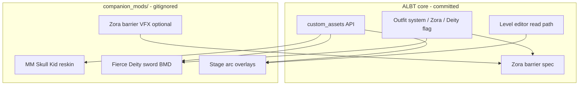

# ALBT companion mods — research pass (no code)

**Status:** Research only (2026-06-27, MM decomp pass 2026-06-19). **v1 product locks (2026-06-19):** Skull Kid textures-only; FD sword cosmetic-on-Deity only. No implementation in the main Dusklight/ALBW tree.

**Purpose:** Plan **separate-release** mods that are **functionally compatible** with A Link Between Twilight (ALBT) but **do not ship inside** the main mod — assets and packs live under `companion_mods/` (gitignored) so the core project stays isolated if porting crosses legal gray areas.

**Audience:** Future companion-mod authors + ALBT integrators.

**Related ALBT foundations:** [Mod-Load-Order-Design.md](../Mod-Load-Order-Design.md), [Custom-Model-API-Work.md](../Custom-Model-API-Work.md), [Code-Mods-Research.md](../Code-Mods-Research.md), [level-editor-phase1.md](../level-editor-phase1.md), [albw-zora-barrier.md](../albw-zora-barrier.md), [albw-deity-armor-shop.md](../albw-deity-armor-shop.md), [sumo-combat.md](../sumo-combat.md), [heros-shade-secret-boss.md](../heros-shade-secret-boss.md).

---

## 1. Distribution model

| Layer | What ships | Where |
|-------|------------|--------|
| **Dusklight + ALBT (main repo)** | C++ features, settings, hooks, empty compatibility stubs | Committed |
| **Companion mod packs** | Models, textures, audio, optional stage overlays | `companion_mods/<ModName>/` — **gitignored** |
| **Player install** | Copy pack → `%AppData%/TwilitRealm/Dusklight/model_replacements/<ModName>/` | Same pipeline as today |

**Compatibility contract (no code required for v0 research):**

1. Companion mods use the **existing** `dusk::custom_assets` layout (`files/` tree, loose BMD, `icons/`, `textures/`).
2. ALBT features **must not hard-require** companion assets — core game falls back to vanilla TP when a pack is absent.
3. Optional `modinfo.ini` fields from [Mod-Load-Order-Design.md](../Mod-Load-Order-Design.md) (`Requirement`, `AddonFor`) can declare `"Requires: ALBT"` without bundling ALBT.
4. **No Nintendo ROM extracts in the main repo.** Companion packs are user-supplied; document extraction from the player's own discs only.

---

## 2. Legal / compliance posture (research note, not legal advice)

- Main repo stays **clean**: no MM/OoT/ALBW ripped meshes/textures committed.
- Companion mods are **third-party drops** the user installs; ALBT documents paths and hooks only.
- Prefer **original work** (modeled/textured from reference) over raw cross-game arc dumps when publishing publicly.
- Behavior references may cite public MM decomp **asset paths and high-level behavior** ([zeldaret/mm](https://github.com/zeldaret/mm)) for companion-mod extraction — do not paste decomp C into the main repo.

---

## 3. Topic A — Zora electric barrier (MM swim offense)

**Product lock (2026-06-19):** ALBT targets **MM-style electric barrier**, not aquatic spin or shield bash. Spec: [albw-zora-barrier.md](../albw-zora-barrier.md).

### 3.1 Name disambiguation (important)

Three different Zelda sources get conflated under "Zora swim + shield/attack":

| Source | Mechanic | Input | Relation to ALBT |
|--------|----------|-------|------------------|
| **ALBW — Zora Helm** | **Aquatic Spin Attack** while swimming (not shield) | Swim + attack button (Y on 3DS) | Closest ALBW-native "Zora swim offense" |
| **MM — Zora Link (water)** | **Electric barrier** ("Zora Magic Force Field") | Hold R while swimming; ram enemies | Already specced in [albw-zora-barrier.md](../albw-zora-barrier.md) for ALBT Zora **outfit** |
| **MM — Zora Link (land/shallow)** | **Fin shield** + B+R barrier on land | R = fin block; B+R = barrier | Different proc family from swim |

**Product decision (locked):** **Track B — MM electric barrier** per [albw-zora-barrier.md](../albw-zora-barrier.md). Aquatic spin (ALBW) and shield bash remain out of scope unless product reopens.

### 3.2 TP / Dusklight engine baseline

| Fact | Code / behavior |
|------|-----------------|
| Underwater sword/shield | **Stripped** — `swimDeleteItem` path; no normal guard procs in swim |
| Zora outfit | `checkZoraWearAbility()`, `getZoraSwim()`, mask draw variants in `d_a_alink_swindow.inc` |
| Swim procs | `procSwimWait/Move/Dive/Damage`, wolf swim parallels |
| R while Zora swim | **Steer/turn** (`setSpeedAndAngleSwim`) — do not steal for offense without rebinding |
| ALBT Zora barrier spec | R1+B hold, submerged only, `dMeter2_subALBWFraction`, electric `At` collider — **product spec exists, not implemented** |

### 3.3 Companion-mod vs core split

| Piece | Core ALBT (C++) | Companion mod |
|-------|-----------------|---------------|
| Input gates, meter drain, damage | Yes | — |
| Electric bubble VFX / spin trail FX | Hook IDs | Optional `.jpa` / eff assets in mod pack |
| New swim proc or spin anim | Yes (anim from TP reuse or new BCK) | Optional Link Zora swim anim overrides |

### 3.4 Feasibility verdict

| Approach | Feasibility | Effort | Risk |
|----------|-------------|--------|------|
| MM-style barrier (existing spec) | **High** | Medium — new swim proc + CC + FX | ALBT uses R1+B (not MM's swim R-only) to preserve TP swim steer |
| ALBW aquatic spin | **Deferred** | — | Not current product intent |
| Shield bash underwater | **Out of scope** | — | Not MM/ALBW behavior |

**Dependencies:** Outfit Stats Zora swim buffs; ALBW meter; optional lockout rules from Quick-Resistance doc.

---

## 4. Topic B — MM Skull Kid textures/materials on TP's Skull Kid

### 4.1 What TP already has

| Asset | Detail |
|-------|--------|
| Actor | `daE_PM_c` — `fpcNm_E_PM_e` (0x1D9), Sacred Grove / lantern chase |
| Arc | `E_PM` — multiple BMDs (body `0x1d`, trumpet `0x1f`, glow `0x1c`, etc.) |
| Role | Boss-adjacent NPC: flute, fog, puppets, `AppearSet()`, demo-heavy |
| ALBT hooks | [TrueALBWWorld.md](../TrueALBWWorld.md) (AppearSet on grove entry), [heros-shade-secret-boss.md](../heros-shade-secret-boss.md) (retextured Skull Kid as gauntlet NPC) |

### 4.2 MM decomp asset map (Skull Kid — textures only v1)

| MM asset | Path in [zeldaret/mm](https://github.com/zeldaret/mm) | Notes |
|----------|--------------------------------------------------------|-------|
| **Skull Kid body + hat** | `assets/xml/objects/object_stk.xml` | Primary textures: `gSkullKidSkinTex`, `gSkullKidShawlTex`, `gSkullKidClothingFringeTex`, `gSkullKidHat*` DLs, `gSkullKidEyeTex`, `gSkullKidBeakTex` |
| **Majora's Mask submesh** | same file | `gSkullKidMajorasMaskFaceTex`, spike/back/eye textures — optional for grove NPC |
| **Flute / Ocarina** | same file | `gSkullKidFluteTex`, `gSkullKidOcarinaOfTimeTex` — map to TP trumpet submesh if desired |
| **Extended anims** | `object_stk2.xml`, `object_stk3.xml` | **Out of scope v1** (no animation port) |
| **Cutscene actor** | `src/overlays/actors/ovl_Dm_Stk/` | Story Skull Kid logic — reference only |
| **NOT Skull Kid** | `object_skb.xml`, `ovl_En_Skb` | **Stalchild** — common naming trap |

Extraction: build MM decomp with user ROM → `object_stk` segment yields PNG/TGA via asset pipeline; convert to TP BTI for reskin tool.

### 4.3 What MM Skull Kid would require

| Work item | Notes |
|-----------|-------|
| **Skeleton / mesh** | MM and TP Skull Kid rigs differ (joint count, cloak, hat chains). **Not a texture-only swap** if silhouette must match MM. |
| **Texture/material port** | Feasible as **reskin** if TP UV layout is preserved or remapped ([BMD-Reskin-Tool.md](../BMD-Reskin-Tool.md), `tools/bmd_reskin/`) |
| **Materials** | MM uses different shader/material flags; PC renderer may need `drawFlag` / blend tweaks per [Custom-Model-API-Work.md](../Custom-Model-API-Work.md) |
| **Animations** | TP `E_PM` BCK set is TP-specific (fog blow, trumpet, run). MM anims **do not drop in** without retarget or new BCK |

### 4.4 Companion-mod delivery path (recommended)

```
companion_mods/MM-SkullKid-Reskin/
  modinfo.ini
  E_PM_29.bmd                        # Layer B — body (0x1D); core hook in daE_PM_c
  E_PM_30.bmd / E_PM_31.bmd          # optional lamp / trumpet
```

Core repo provides `try_load("E_PM", index)` fallback in `daE_PM_c::CreateHeap` — **no arc repack**.

- **Phase 1 research deliverable:** Export TP `E_PM` body BMD + UV template; paint MM-style textures; validate in Grove scene.
- **Phase 2:** Hat/cloak material params; trumpet submesh if needed.
- **Do not** commit MM `.bmd`/`.bti` binaries to main repo.

### 4.5 Feasibility verdict

| Scope | Verdict |
|-------|---------|
| **MM look on TP Skull Kid (reskin)** | **Feasible** — **v1 locked:** textures/materials only; Grove playtest |
| **Full MM skeleton + anims on TP actor** | **Out of scope v1** — retargeting project |
| **New Skull Kid behavior / gauntlet AI** | Core ALBT — separate from texture mod ([heros-shade-secret-boss.md](../heros-shade-secret-boss.md) deferred) |

---

## 5. Topic C — Maps porting feasibility

### 5.1 What "port maps" could mean

| Interpretation | Realistic? |
|----------------|------------|
| **OoT → TP** geometry (community private tools) | **Already happening** — same Zelda 64 lineage; not blocked by Dusklight, but **outside this repo** |
| **MM → TP** literal room paste | **Hard** — N64 scene/room (F3DGX) ≠ GC stage arc (J3D + DZB); needs rebuild or custom importer |
| **New** TP rooms inspired by other games | **Yes** — level editor + stage arc overlay |
| **Edit existing** TP rooms (ALBT True World, shops, grove) | **Yes** — highest ROI |

**MM decomp map format ([zeldaret/mm](https://github.com/zeldaret/mm)):** scenes under `assets/xml/scenes/` (e.g. `Z2_20SICHITAI/`) — each scene XML references room segments with named F3D display lists, shared `scene_texture_*.xml` externals. Useful as **layout reference** and for OOT/MM cross-tooling; not drop-in for TP `files/Stage/`.

### 5.2 Dusklight tooling state ([level-editor-phase1.md](../level-editor-phase1.md))

| Capability | Status |
|------------|--------|
| Read placed actors (DZS/DZR in memory) | ✅ Phase 1x |
| Live non-persisted edits | ✅ |
| Ship edits via Aurora `files/` overlay | ✅ ([Custom-Model-API-Work.md](../Custom-Model-API-Work.md)) |
| **Write** RARC / YAZ0 stage arcs in-engine | ❌ Not built — offline tool needed |
| DZB terrain authoring | ❌ Later tier |

### 5.3 Practical map-mod pipeline (companion)

1. **Inspect** room in Level Editor mode.
2. **Export** actor list + params (future); today: manual notes or external DZR tools.
3. **Edit** offline (community TP stage tools or hex/DZR editors).
4. **Ship** repacked `.arc` under `companion_mods/<MapMod>/files/Stage/...` (exact path mirrors disc).
5. ALBT **does not** depend on map mod; True ALBW World remains default.

### 5.4 Feasibility verdict

| Goal | Verdict |
|------|---------|
| Ship **custom TP stage variants** as companion mods | **Feasible** via Layer A overlay; editor helps authoring |
| Port **OoT maps** to TP (private tools) | **Feasible in community** — revise upward vs phase-1 pessimism; ALBT ships overlay path only |
| Port **MM maps** literally to TP | **Not direct** — format + collision rebuild; OOT pipeline may partially apply |
| In-game **arc writer** | **Future core work** — benefits all mods, not companion-only |

---

## 6. Topic D — Fierce Deity two-handed weapon (feasibility for TP)

### 6.1 Why this matters for ALBT

ALBT already plans **Fierce Deity** as Magic Armor + flag overlay ([albw-deity-armor-shop.md](../albw-deity-armor-shop.md), [Quick-Sumo Work.md](../Interconnected%20Chats/Quick-Sumo%20Work.md) CAUTION). A **two-handed sword** is a separate weapon-class question: can TP Link hold a large sword like MM FD?

### 6.2 TP precedent (engine-native two-hand)

| System | Location | Relevance |
|--------|----------|-----------|
| **Iron Ball** | `dItemNo_IRONBALL_e`, `checkTwoHandItemEquipAnime()`, `mTwoHandEquipAnm` | Full two-hand item proc family |
| **Item matrix** | `setItemMatrix()` — sword on `mLeftItemJntNo`, shield on `mRightItemJntNo`; iron ball uses `0x103` equip path | Joint parenting rules |
| **Upper anims** | `dRes_ID_ALANM_BCK_TAKE_e` two-hand equip | Animation bucket exists |

**Key insight:** TP already supports **two-hand items** as a distinct equip class, not as "sword + empty shield."

### 6.3 MM Fierce Deity model (reference — [zeldaret/mm](https://github.com/zeldaret/mm))

| Asset | MM path | Notes |
|-------|---------|-------|
| FD Link body + limbs | `assets/xml/objects/object_link_boy.xml` | `gLinkFierceDeity*DL` family, dedicated TLUTs |
| **FD sword mesh** | same file | `gLinkFierceDeitySwordDL`, `gLinkFierceDeityLeftHandHoldingSwordDL`, `gLinkFierceDeityHandHoldingTex` |
| **NOT FD sword** | `object_gi_sword_4.xml` | Great Fairy's Sword **get-item** model |

- FD sword is **single mesh** with a left-hand holding variant in MM's skeleton.
- TP would need either:
  - **A)** New item type cloning iron-ball hand logic with sword collision, or
  - **B)** Oversized **one-hand** sword model with adjusted grip offsets in `setItemMatrix` (simpler, less authentic),
  - **C)** FD **outfit overlay** (like sumo/deity body) + separate **sword BMD** attached to left hand only with scale/offset cheat.

### 6.4 Research deliverable (no code)

1. Extract `object_link_boy` FD sword DL + hand-holding DL from MM build (user ROM); compare grip to TP `setItemMatrix`.
2. Compare to TP `Link` hand joints (`mLeftItemJntNo`, `field_0x30b6` sheath bone).
3. Prototype **companion-only** loose BMD: `Link_XX.bmd` or sword arc override — validate grip in idle / slash BCK.
4. Document whether **shield slot must be forced empty** during two-hand (iron ball model).

### 6.5 Feasibility verdict

| Approach | Verdict |
|----------|---------|
| Visual-only FD sword (large 1H attachment) | **High** — companion asset + matrix tuning |
| True two-hand weapon class (new item) | **Medium** — iron-ball proc fork; ALBT combat balance |
| FD anims from MM | **Low** — retarget; use TP great-sword / spin anims first |

---

## 7. Topic E — Fierce Deity sword (companion asset)

### 7.1 Separation from Deity Armor shop

| Feature | Core ALBT | Companion mod |
|---------|-----------|---------------|
| Deity Armor shop session (5000r, flag, ceremony) | ✅ Implemented / specced | — |
| FD **body** overlay on Magic Armor | Core or companion textures | `Kmdl` / magic armor reskin in `companion_mods/` |
| FD **sword** as distinct weapon | Optional hook | **Primary companion deliverable** |

### 7.2 Delivery options

| Option | Description | ALBT coupling |
|--------|-------------|---------------|
| **Sword replacement** | Loose `Link_XX.bmd` or sword arc override when Deity flag set | Core checks flag → mod provides asset |
| **New item ID** | New `dItemNo` (requires core) | Strong coupling — avoid for v1 companion |
| **Master Sword skin** | Replace MS/Light sword BMD when flag + equipped | Weakest code; may conflict with sword cycle |

### 7.3 Suggested companion pack layout

```
companion_mods/Fierce-Deity-Sword/
  modinfo.ini
  files/res/Item/...             # if whole arc needed
  Link_12.bmd                    # example loose index — verify against sword arc
  icons/                         # optional itemicon for UI
```

### 7.4 Stats / combat (design-only)

Defer to ALBT balance thread:

- Damage tier vs Master / Light / gold sword
- Durability / FA spend interaction
- Two-hand vs one-hand (§6)

### 7.5 Feasibility verdict

**v1 locked:** cosmetic sword replacement **only while Deity Armor session flag is active** — no new `dItemNo`, no D-pad equip, no combat stat changes. Master Sword / Light sword arc or loose BMD override gated by existing Deity flag check (minimal core hook: flag set → `custom_assets` may override; flag clear → vanilla sword).

**Feasible as companion asset mod** with **minimal** core hook: "when `DEITY_ARMOR` flag and sword equipped, allow custom_assets override." No new mechanics required for v0 visual.

---

## 8. Cross-topic dependencies



---

## 9. Recommended research → implementation order

| Priority | Topic | Next concrete step |
|----------|-------|-------------------|
| 1 | **Skull Kid reskin** | TP `E_PM` UV export → MM-style texture paint (local MM Recomp + HD pack as reference) → Grove playtest |
| 2 | **FD sword (visual)** | Loose BMD or sword arc override; test **only** during active Deity session |
| 3 | **Zora barrier** | Core proc per spec; optional companion FX pack later |
| 4 | **Two-hand study** | Deferred — not needed for cosmetic-only FD sword v1 |
| 5 | **Maps** | Deferred — optional layout packs when needed |

---

## 10. Open questions for product owner

1. ~~**Zora swim attack**~~ — **Resolved:** MM electric barrier ([albw-zora-barrier.md](../albw-zora-barrier.md)).
2. ~~**Skull Kid**~~ — **Resolved (v1):** **Textures/materials only** on TP `E_PM`; no anims, no gauntlet AI.
3. ~~**FD sword**~~ — **Resolved (v1):** **Cosmetic only** when Deity session flag active; not a standalone weapon.
4. **Map mods** — ALBT True World replacements, or optional "layout packs"?
5. **Companion mod distribution** — Nexus/Discord zip only, or in-launcher downloader (out of scope for research)?

### 10.1 v1 companion-mod scope (locked 2026-06-19)

| Mod folder (suggested) | Scope | Core repo coupling |
|------------------------|-------|-------------------|
| `MM-SkullKid-Reskin` | `E_PM` BMD/arc texture swap | Layer-B hook in `daE_PM_c` (vanilla fallback) |
| `Fierce-Deity-Sword` | Sword BMD when Deity flag + sword equipped | Optional one-line override gate; vanilla without mod |
| `Zora-Barrier-FX` | Optional electric bubble `.jpa`/eff | None until barrier proc exists |

**MM reference (author machine, not in git):** local Zelda64Recompiled install + HD texture mods (e.g. MMN64HD / MM Reloaded) for screenshots — assets converted to TP format land in gitignored `companion_mods/`.

---

## 11. Flurry / FA doc catch-up (2026-06-27)

Consolidated into [albw-flurry-rush-brief.md](../albw-flurry-rush-brief.md) and [state/combat-refinements.md](../state/combat-refinements.md):

- Phases 1–5 + snap committed (`09eb67aa22`); Phase 6+ remains.
- Sumo outfit **shipped** — wood+sumo gate ready to enforce when Flurry work resumes.
- Parry walk-away crash tracked in [parry-fa-crash-handoff.md](../parry-fa-crash-handoff.md) (not sumo; defensive hardening 2026-06-27, playtest pending).
- Flurry ownership may move to another chat; brief stays canonical.

---

## 12. MM decomp research pass — [zeldaret/mm](https://github.com/zeldaret/mm) (2026-06-19)

**Source:** US N64 Majora's Mask matching decompilation. **Assets are not in git** — extracted from the user's own ROM via the project build (`assets/xml/` maps segments to named files). ~100% matched; useful as a **path index** for companion-mod extraction and behavior reference.

**Cross-engine rule:** MM = N64 **F3DGX** display lists + Flex skeletons. TP = GC **J3D BMD/BCK**. Textures can be converted (PNG → BTI); meshes need retopo or automated DL→BMD tooling — never raw binary paste across engines.

### 12.1 Repository layout (relevant slices)

| Area | Path | Companion-mod use |
|------|------|-------------------|
| Object XML | `assets/xml/objects/*.xml` | Named DLs, textures, skeletons — extraction targets |
| Scenes | `assets/xml/scenes/Z2_*` | Room layout reference; F3D DL lists per room |
| Player | `src/overlays/actors/ovl_player_actor/z_player.c` | Form abilities, barrier logic |
| Player lib | `src/code/z_player_lib.c` | Draw helpers (`Player_DrawZoraShield`, FD limb overrides) |
| Skull Kid | `ovl_Dm_Stk`, `object_stk{,2,3}` | Texture source for TP `E_PM` reskin |
| Tutorial | `docs/tutorial/` (+ z64utils screenshots) | Object/scene extraction workflow |

### 12.2 Zora electric barrier — MM implementation map

**Wrong asset:** `ovl_Eff_Zoraband` / `object_zoraband` = **Indigo-Go / Mikau healing cutscene**, not combat barrier.

| Layer | MM location | Behavior |
|-------|-------------|----------|
| **Input (swim)** | `z_player.c` → `Player_Action_54` | `func_8082F164(this, BTN_R)` — **hold R while swimming** |
| **Input (land fin block)** | `Player_UpperAction_3` | Hold R → fin shield; **R + B** also calls barrier start |
| **State flag** | `PLAYER_STATE1_10` | Set while barrier button combo held |
| **Intensity** | `player->unk_B62` (0–255) | Ramps with magic; fades when released/empty |
| **Magic drain** | `func_8082F1AC` | `Magic_Consume(..., MAGIC_CONSUME_GORON_ZORA)`; needs ≥16 magic for full strength |
| **Collision** | `z_player.c` update (~12762) | When `unk_B62 != 0`: `shieldCylinder` AT on, **dmgFlags `0x80000`**, radius 50, height 80 |
| **Lighting** | `sZoraBarrierEnvLighting` | Yellow diffuse + blue fog lerp by intensity |
| **SFX** | `NA_SE_PL_ZORA_SPARK_BARRIER` | Looping spark while active |
| **Ground ripple** | `Actor_SetPlayerImpact(..., PLAYER_IMPACT_ZORA_BARRIER, ...)` | Shared impact system in `z_actor.c` — water/ground disturbance, not the bubble mesh |
| **Bubble VFX** | `Player_DrawZoraShield` in `z_player_lib.c` | Draws `object_link_zora_DL_011760` (**original name `zora_thunder_modelT`**) |
| **Bubble details** | `object_link_zora.xml` | Animated mat `object_link_zora_Matanimheader_012A80`; i8 scroll textures; per-vertex alpha from `unk_B62`; scale ∝ intensity |

**ALBT divergence (intentional):** MM swim barrier = **R only**. ALBT spec = **R1 + B hold** while submerged ([albw-zora-barrier.md](../albw-zora-barrier.md)) so TP Zora swim **R steer** (`setSpeedAndAngleSwim`) stays untouched. Companion mod can still reuse **visual** vocabulary from `zora_thunder_modelT` / electric scroll textures.

**Companion-mod deliverable:** optional `companion_mods/Zora-Barrier-FX/` with TP `.jpa` / eff textures **inspired by** MM thunder DL — core ALBT implements proc + collider; pack is cosmetic.

### 12.3 Skull Kid — correct object files

| Name | Actually |
|------|----------|
| `object_stk` | **Skull Kid** (body, hat, mask, flute, core anims) |
| `object_stk2`, `object_stk3` | Additional Skull Kid animations |
| `ovl_Dm_Stk` | Cutscene / observatory Skull Kid actor |
| `object_skb`, `ovl_En_Skb` | **Stalchild** — ignore for Skull Kid reskin |

**v1 scope (locked):** TP `E_PM` **textures/materials only** — export MM `object_stk` texture set, remap onto TP UV template via BMD reskin tool; no `stk2`/`stk3` animation port.

### 12.4 Fierce Deity sword + two-hand

| Asset | Path | Notes |
|-------|------|-------|
| FD body | `object_link_boy.xml` | Full transformation skeleton |
| FD sword | `gLinkFierceDeitySwordDL` | Standalone sword DL |
| Grip variant | `gLinkFierceDeityLeftHandHoldingSwordDL` | Hand + sword composite |
| Hand tex | `gLinkFierceDeityHandHoldingTex` / TLUT | CI8 + rgba16 palette |

`object_gi_sword_4` = Great Fairy's Sword pickup icon mesh — **do not use** for FD companion sword.

**TP integration (unchanged from §6):** iron-ball two-hand proc **or** oversized 1H attachment with matrix offset; companion pack ships converted BMD.

### 12.5 Maps — MM decomp vs OoT private tools vs TP

| Pipeline | Format | ALBT companion-mod fit |
|----------|--------|------------------------|
| **OoT → TP** (community private tools) | Z64 F3D → TP stage rebuild | **Proven externally** — document overlay install only |
| **MM → TP** via decomp | `assets/xml/scenes/Z2_*` rooms | Reference layouts + texture names; **no direct TP arc** |
| **TP native** | Aurora `files/Stage/` overlay | Level editor read path + offline DZR edit ([level-editor-phase1.md](../level-editor-phase1.md)) |

MM scene example (`Z2_20SICHITAI`): scene header + per-room DL offsets + external `scene_texture_06` — same **engine family as OoT**, different file naming (`Z2_` prefix). Tools that already port OoT rooms may extend to MM with scene-table work; Dusklight does not need to own that importer for companion mods to ship.

### 12.6 Extraction workflow (for mod authors)

1. Clone [zeldaret/mm](https://github.com/zeldaret/mm), provide **personal** US MM ROM per project docs.
2. Build → assets materialize under build tree as PNG/TLOOT/etc. from XML definitions.
3. For a target object (e.g. `object_stk`): use XML texture `OutName` list as checklist against TP reskin slots.
4. For barrier FX reference: inspect extracted `zora_thunder_modelT` + i8 scroll textures; reauthor in TP eff format.
5. **Never commit** extracted Nintendo assets to dusklight main repo — drop into gitignored `companion_mods/`.

### 12.7 Phase-2 verdict summary

| Topic | MM decomp outcome | Companion mod? |
|-------|-------------------|----------------|
| Zora barrier | Full behavior + VFX path identified; `Eff_Zoraband` ruled out | Optional FX pack; core in ALBT |
| Skull Kid | `object_stk` texture inventory mapped | **Primary texture reskin mod** |
| FD sword | `object_link_boy` sword DLs confirmed | **Primary asset mod** |
| FD two-hand | MM single mesh + TP iron-ball precedent | Research + matrix prototype |
| Maps | MM scenes documented; OoT porting **upgraded** feasibility | TP overlay template still best in-repo deliverable |
